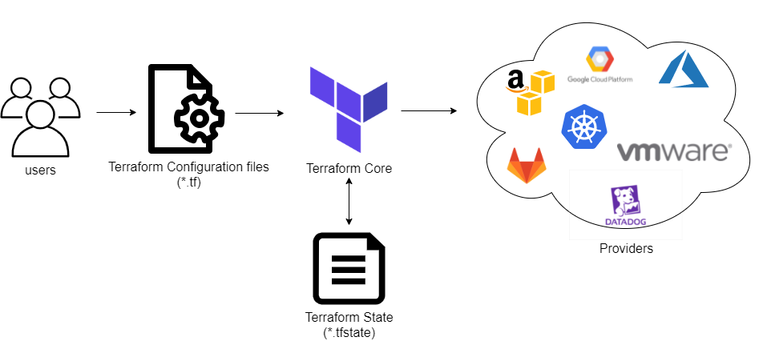
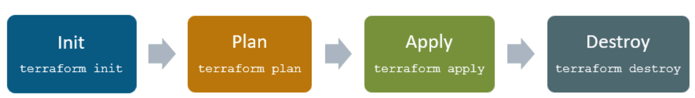

### What is Terraform?
* Terraform is an open-source infrastructure as code (IaC) tool developed by HashiCorp. 
* It enables users to define and manage infrastructure resources, such as virtual machines, storage accounts, and networking components, across multiple cloud providers and on-premises data centers.
* Terraform uses a declarative language to define infrastructure as code, allowing users to write human-readable code that describes the desired state of their infrastructure. 
* The tool then provisions the necessary resources to achieve that state, and also enables users to manage changes and updates to the infrastructure over time.
* Terraform supports a wide range of cloud providers, including Amazon Web Services (AWS), Microsoft Azure, Google Cloud Platform (GCP), and many others. 
* This enables users to manage resources across multiple clouds and even hybrid environments.
---
- ### How does terraform work?
  1. One is the terraform core: it takes the terraform configuration which is being provided by the user and then takes the terraform state which is managed by terraform itself. As such, this gets fed into the core  that is responsible for figuring out what is that graph of our different resources for exemple how these different pieces relate to each other or what needs to be created/updated/destroyed, it does all the essential lifecycle management.
  
  1. On the backside, terraform supports many different providers , such as: cloud providers (AWS,GCP,AZURE)  and they also could be on-premise infrastructure (VMware,OpenStack.) But this support is not restricted or limited only to Infrastructure As A Service , terraform can also manage higher level like Platform As A Service(Kubernetes,Lambdas..)or even Software As A Service (DataDog,GitHub..)
  
  ---
- ### Terraform lifecycle
  * Terraform lifecycle consists of – **init**, **plan**, **apply**, and **destroy**.
  
  1. **Terraform init** initializes the (local) Terraform environment. Usually executed only once per session.
  2. **Terraform plan** compares the Terraform state with the as-is state in the cloud, build and display an
  execution plan. This does not change the deployment (read-only).
  3. **Terraform apply** executes the plan. This potentially changes the deployment.
  4. **Terraform destroy** deletes all resources that are governed by this specific terraform environment.
   
  ---
- ### Key concepts of Terraform
  1. **Infrastructure as Code**: Terraform enables users to write code to describe their infrastructure resources, making it easy to maintain, version control and reuse infrastructure components.
  
  1. **Provider**: A provider is a plugin that Terraform uses to interact with a specific cloud provider or service. Terraform has providers for many cloud providers, including AWS, Azure, GCP, and more.
  
  1. **Resource**: A resource is a virtual representation of an infrastructure component, such as an EC2 instance in AWS or a virtual machine in Azure. Terraform allows users to define, provision, and manage resources across multiple providers.
  
  1. **State**: Terraform stores the state of the infrastructure in a file that can be used to track changes to the infrastructure over time. This enables Terraform to manage changes to the infrastructure and ensure it remains in the desired state.
  
  1. **Plan**: Terraform generates a plan of the changes that will be made to the infrastructure before applying those changes. This allows users to preview the changes and ensure they are correct before applying them.
  
  1. **Modules**: Terraform modules are reusable components that encapsulate infrastructure resources and their configurations. Modules can be shared and reused across multiple projects, making it easier to manage infrastructure across different environments.
  
  ---
- ### Terraform configuration files
  * Configuration files are a set of files used to describe infrastructure in Terraform and have the file extensions .tf and .tf.json. Terraform uses a declarative model for defining infrastructure. Configuration files let you write a configuration that declares your desired state. Configuration files are made up of resources with settings and values representing the desired state of your infrastructure.
  
  * A Terraform configuration is made up of one or more files in a directory, provider binaries, plan files, and state files once Terraform has run the configuration.
  
  1. **Configuration file (*.tf files)**: Here we declare the provider and resources to be deployed along with the type of resource and all resources specific settings
  
  2. **Variable declaration file (variables.tf or variables.tf.json)**: Here we declare the input variables required to provision resources
  
  3. **Variable definition files (terraform.tfvars)**: Here we assign values to the input variables
  
  4. **State file (terraform.tfstate)**: a state file is created once after Terraform is run. It stores state about our managed infrastructure.
  